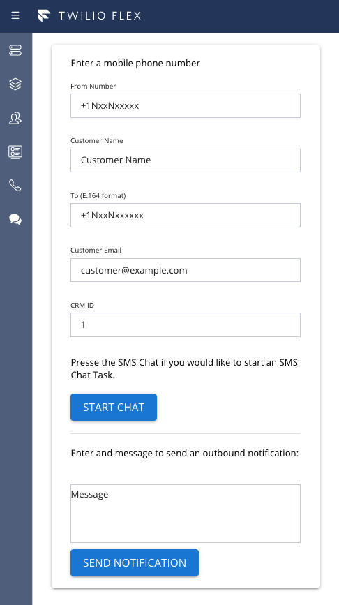

# plugin-sms-chat
 # Twilio Flex Plugin - plugin-sms-chat



## Setup

Make sure you have [Node.js](https://nodejs.org) as well as [`npm`](https://npmjs.com) installed.

Afterwards install the dependencies by running `npm install`:

```bash
cd 

# If you use npm
npm install
```

## Development

In order to develop locally, you can use the Webpack Dev Server by running:

```bash
npm start
```

This will automatically start up the Webpack Dev Server and open the browser for you. Your app will run on `http://localhost:8080`. If you want to change that you can do this by setting the `PORT` environment variable:

```bash
PORT=3000 npm start
```

When you make changes to your code, the browser window will be automatically refreshed.

Create the two Twilio Functions from the Functions Folder
1. create-sms-chat
2. send-sms

Setup new FlexFlows for direct to task routing.  Sent Enabled=false and JanitorEnabled=true. 

Example cURL:
```bash
curl -X POST \
https://flex-api.twilio.com/v1/FlexFlows \
--data-urlencode 'ChannelType=sms' \
--data-urlencode 'IntegrationType=task' \
--data-urlencode 'Enabled=false' \
--data-urlencode 'FriendlyName=Flex SMS to Task Flow' \
--data-urlencode 'ContactIdentity={{TWILIO_NUMBER}}' \
--data-urlencode 'ChatServiceSid={{CHAT_SERVICE_SID}}' \
--data-urlencode 'Integration.WorkspaceSid={{TR_WORKSPACE_SID}}' \
--data-urlencode 'Integration.WorkflowSid={{TR_WORKFLOW_SID}}' \
--data-urlencode 'Integration.Channel={{TR_TASKCHANEL_PROGRAMMABLE_CHAT_SID}}' \
--data-urlencode 'JanitorEnabled=true'

```bash


## Deploy

Once you are happy with your plugin, you have to bundle it, in order to deply it to Twilio Flex.

Run the following command to start the bundling:

```bash
npm run build
```

Afterwards, you'll find in your project a `build/` folder that contains a file with the name of your plugin project. For example `plugin-example.js`. Take this file and upload it into the Assets part of your Twilio Runtime.

Note: Common packages like `React`, `ReactDOM`, `Redux` and `ReactRedux` are not bundled with the build because they are treated as external dependencies so the plugin will depend on Flex which would provide them globally.


